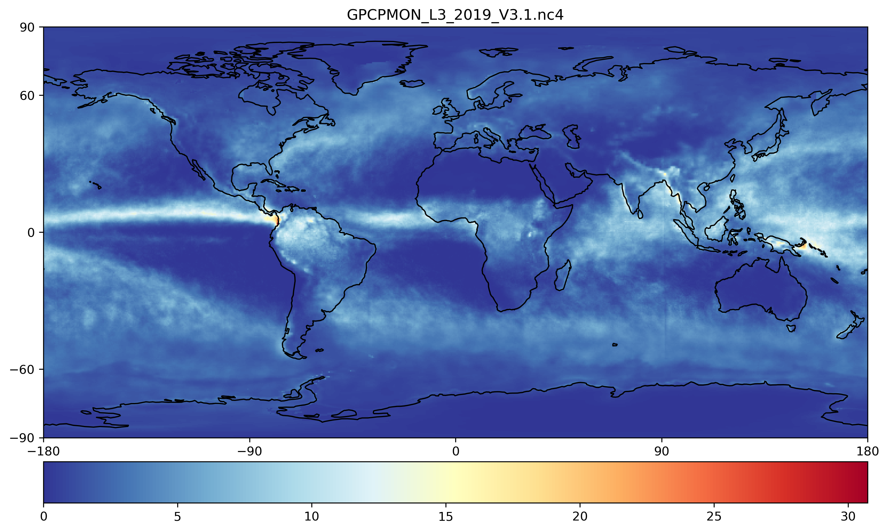
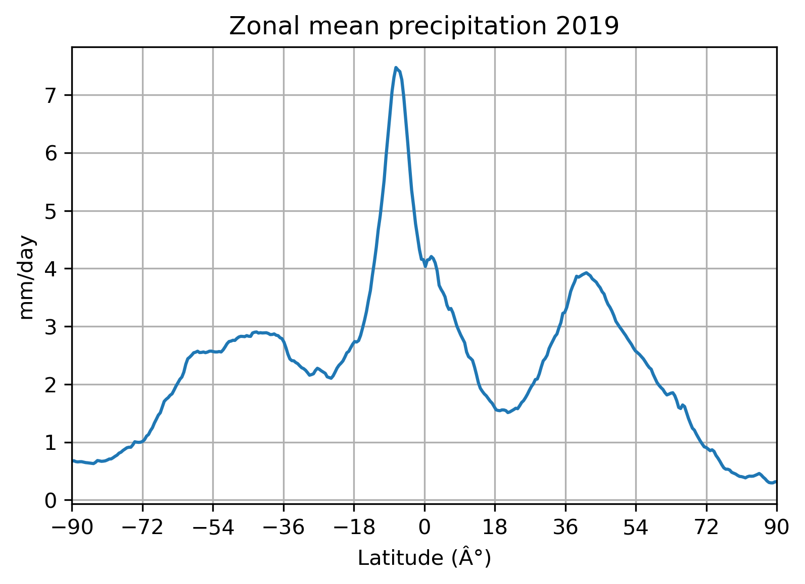

# Zonal-mean-precipitation
Zonal mean of precipitation using GPCP

## Summary

In this document I describe the process I followed to create a zonal mean of precipitation
from monthly precipitation data from the GPCP product. The data is read from NetCDF format
and then zonal (latitudinal) mean of precipitation is calculated and plotted in a 2D image.

* Go to <https://disc.gsfc.nasa.gov/>.
* Search for GPCP V3.1.
* Downloaded all the monthly data for year 2019.

For more information about how to download the data using a PowerShell script (for Windows)
and other details, please refer to the documentation in the repository for [Snapshots of bright temperature from a hurricane](https://github.com/eduardo-jh/Storm-Snapshot-Brightness-Temp).

## Download script

The PowerShell script used to download the data from GES DISC is:

    # A script to download data from NASA GES DISC
    # By Eduardo Jimenez Hernandez, PhD student University of Arizona
    # 27 Aug 2021
    $dir = "D:\Downloads\ATMO555\Assignment_E2"
    $username = "eduardojh"
    $pass = "password"
    #$filelist = $dir + "\subset_GPCPMON_3.1_20210903_014149.txt"
    $filelist = $dir + "\subset_GPCPMON_3.1_20210902_224359.txt"
    $cookies = $dir + "\.urs_cookies"
    # Create cookies file in order to save the login information when downloading multiple files
    $null > $dir\.urs_cookies
    # Download files from a text file
    wget --load-cookies $cookies --save-cookies $cookies --auth-no-challenge=on --keep-session-cookies --user=$username --password=$pass -i $filelist

As usual, all the actual links to download the NetCDF files are in a text file.

## Plotting the information

The Python code used for reading the NetCDF files, averaging the values by latitude, and
creating the plots is shown below.

    # -*- coding: utf-8 -*-
    """
    ATMO555 Assignment E2. Snapshots of tropical storm, 09/01/2021
    Created on Thu Sep  2 18:27:37 2021

    @author: eduardo
    """

    from os import listdir
    from os.path import isfile, join
    from osgeo import gdal
    import numpy as np
    import matplotlib.pyplot as plt
    import cartopy.crs as ccrs

    THRESHOLD = 0 # Remove data below this value
    EXTENSIONS = ['NC4']

    # Directory where the images are located
    directory = 'D:/Downloads/ATMO555/Assignment_E2'

    # Extract the list of files and filter by extension
    onlyfiles = [f for f in listdir(directory) if isfile(join(directory, f))]
    files = [f for f in onlyfiles if f[-3:].upper() in EXTENSIONS]

    # Get the dimensions
    ds = gdal.Open(files[0], gdal.GA_ReadOnly)
    band = gdal.Open(ds.GetSubDatasets()[0][0], gdal.GA_ReadOnly)
    data = band.ReadAsArray()
    print(data.shape)
    mean = np.zeros(data.shape)  # Shape of the data known beforehand

    # Calculate zonal (latitudinal) mean of precipitation
    mean_lat = np.zeros(mean.shape[0])

    # Open each file and read the precipitation values
    i = 0
    for fn in files:
       print('Processing file {0} of {1} [{2}]'.format(i+1, len(files), fn))

       # Open the file
       ds = gdal.Open(fn, gdal.GA_ReadOnly)

       datasets = ds.GetSubDatasets()
       # # IMPORTANT: Print the datasets to see their names and select the one you want
       # for d in datasets:
       #     print(d)
       band = gdal.Open(datasets[0][0], gdal.GA_ReadOnly)

       # Get the geotransform metadata (extension) of the figure to scale the figure
       geoTransform = band.GetGeoTransform()
       # print(geoTransform)
       minx = geoTransform[0]
       maxy = geoTransform[3]
       maxx = minx + geoTransform[1] * band.RasterXSize
       miny = maxy + geoTransform[5] * band.RasterYSize
       print("Spatial extent [minx,miny,maxx,maxy]: ", [minx, miny, maxx, maxy])

       # Extract the temperature matrix data
       # data = band.ReadAsArray(0, 0, band.RasterXSize, band.RasterYSize)
       data = band.ReadAsArray()
       data[data < THRESHOLD] = THRESHOLD  # Remove data below threshold

       mean += data

    # Compute mean of precipitation of all the files
    mean /= len(files)

    # Create a figure and plot a coastline
    plt.figure(figsize=(12,12))
    ax = plt.axes(projection=ccrs.PlateCarree())
    ax.coastlines()
    ax.set_xticks([-180,-90,0,90,180])
    ax.set_yticks([-90,-60,0,60,90])

    # Plot the temperature matrix data and save the figure
    # plt.imshow(data1, extent=[-180,180,-90,90], cmap='RdYlBu_r', origin='lower')
    plt.imshow(mean, extent=[minx,maxx,miny,maxy], cmap='RdYlBu_r') # This has two times: 0 or 1
    plt.title('GPCPMON_L3_2019_V3.1.nc4')
    plt.colorbar(orientation='horizontal', pad=0.03)
    plt.savefig('GPCPMON_mean_2019.png', dpi=300, bbox_inches='tight')

    plt.show()
    plt.close()

    # Calculate zonal (latitudinal) mean of precipitation
    mean_lat = np.zeros(mean.shape[0])
    for row in range(len(mean)):
       # print(row)
       mean_lat[row] = np.average(mean[row])

    # Zonal mean precipitation plot
    plt.figure()
    plt.plot(np.linspace(-90,90,360), mean_lat)
    ax = plt.axes()
    ax.set_xticks(np.linspace(-90,90,11))
    plt.xlim(-90, 90)
    plt.title('Zonal mean precipitation 2019')
    plt.xlabel('Latitude (°)')
    plt.ylabel('mm/day')
    plt.grid()
    plt.savefig('Zonal_mean_precip_2019.png', dpi=300, bbox_inches='tight')

The plot of the mean values for precipitation is presented in the following figure:

The data is then averaged by latitude, and plotted. The zonal mean precipitation plot is:

**Note:** Due to download errors only April-December files for 2019 were processed.
